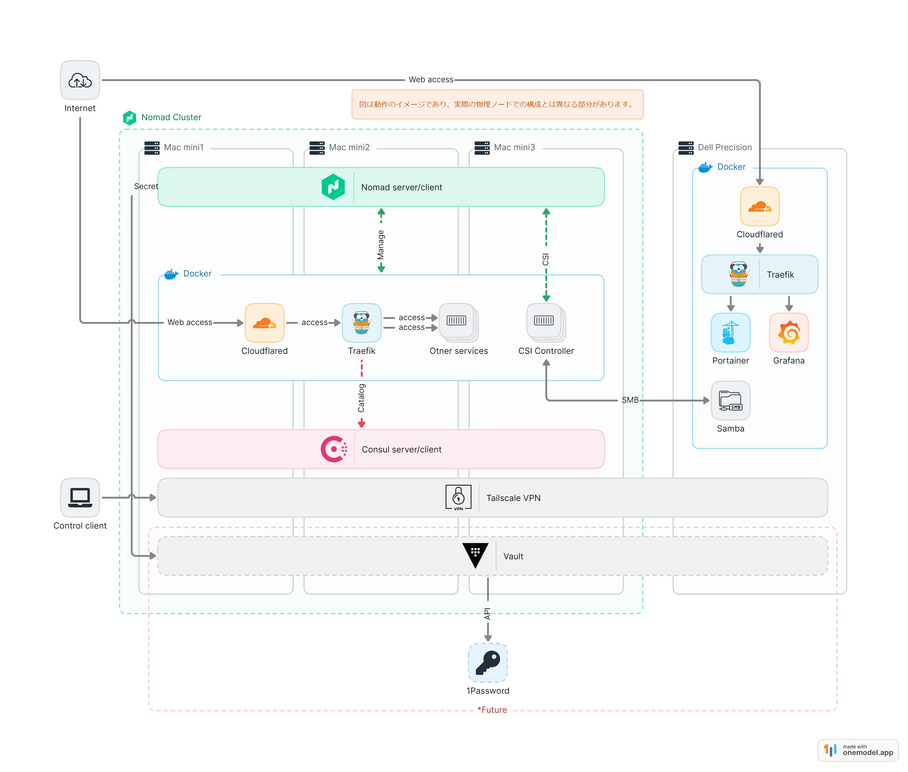

<h1 align="center">My Nomad Cluster</h1>
<p align="center">なぜNomadのクラスタを構築するに至ったのか、どのような要件を満たすために構築したのか。<br/>また、Nomadクラスタの現状の課題についてまとめる。</p>

## TL;DR
自分が一番使いやすいプライベートクラウドの模索、構築

## 構築のモチベーション
- 様々なOSSと出会い、それらを検証する基盤が必要だった。
- 1ノードのDockerサーバーなどでは可用性に問題があり、サービスを立ち上げたいときにすぐに立ち上げられない可能性がある。
- コンテナのスケーリングなど、コンテナオーケストレーションを学びたかった。

## システムの要件
- 思い立ったらすぐにサービスを立ち上げられる、フットワークの軽いシステムであること。
- 常時稼働が必要なサービスを立ち上げることは想定せず、サービスの検証を妨げない程度の可用性があること。
- 基盤のメンテナンスが容易であること。

## 選定
### Nomad
- 機能が少ない代わりに、シンプル・軽量である。
- DockerやPodman以外にJava、Qemuなど非コンテナサービスも実行できる。
- 周りに使っている人がいなかったので、使ってみたかった。
### Consul
- サービスディスカバリとして選定。
- Nomadとの連携が簡単である。
### Traefik
- リバースプロキシ・ロードバランサとして選定。
- 外部からのアクセスを受け付ける。
- ```tags```にルールを記述することで、サービスの自動登録、ルーティングが可能。
- Consulとの連携が簡単である。
### Cloudflared・Cloudflare Tunnel
- 外部からのアクセスをTunnelを介してTraefikに渡す。
- CloudflareのDNSに直接設定できるため、DNSの設定が容易である。
- Zero Trust Networkの構築が容易である。
### SMB CSI
- Nomadマシンのスペックが低く、CephやMinIOを構築できないため、やむなくSMBを採用。　
- SMBのホストマシンは、以前から稼働しているDockerサーバー。
### Tailscale VPN
- 非公開ネットワーク用に選定。
- 接続が容易である。
- 必要であれば共有リンクを発行でき、Tailscale上でACLを設定できるため、管理が容易である。
### Vault・1Password ```構築中```
- シークレット管理として選定。
- Vaultと1Passwordを連携できるらしく、試してみたい。
### Ansible（sometimes Terraform）```構築中```
- マシンの構築を自動化するために選定。
- 気になるので、サービスの立ち上げにTerraformも使ってみたい。
### （Drone CI）
- **調査中**
- GithubにTerraformのコードをPushして、Nomadでサービスが立つようにしたい。

## 構成
以下は、現在の構成図である。あくまで動作のイメージであり、実際には各ホストマシン上で個別にアプリケーションが動作し、それぞれが連携している。


実際にサービスを立ち上げると、Docker上に立ち上がる。図中では```Otner services```としている。

## 結果・課題
### 達成できたこと
- OSSの検証環境の構築は達成できた。
- オーケストレーション技術の基礎を学ぶことができた。

### 課題
- CSIがシングルノードのため、単一障害点となっている。
- 想定以上に情報が少なく、構築に時間がかかった。そのため、フットワークの軽いシステムという点では少し不満が残る。
    - 過程で得た情報をZennなどで発信したい。
- 再構築やノードの追加が容易でない。
    - Ansibleを使って自動化予定。